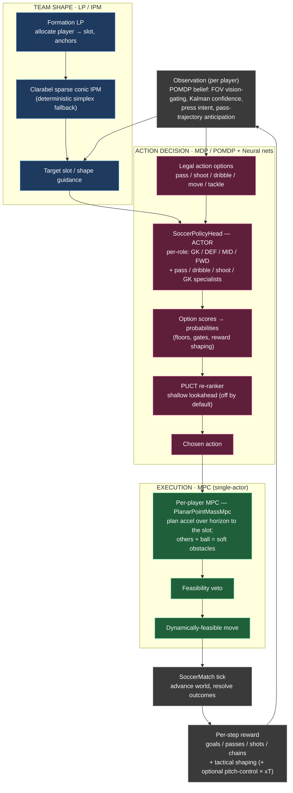
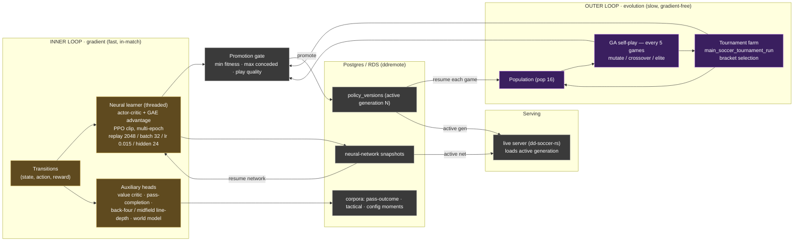

# Soccer system flowchart — who solves what

One picture of the whole engine, organized by the **mathematical tool** doing the
work. The soccer engine is deliberately a *portfolio* of methods, each matched to a
problem it is actually good at, rather than one big network:

- **LP / IPM (Clarabel)** — team **shape allocation** (static, per tick).
- **MPC** — one player's **trajectory execution** (short horizon, dynamics).
- **MDP / POMDP** — one player's **action decision** under partial observability.
- **Neural nets** — the **function approximators** that score those decisions and
  predict outcomes, trained by gradient (actor-critic / PPO).
- **Evolution / GA** — the **outer, gradient-free** loop that selects whole
  policies across many games and tournaments.
- **Vectors / HNSW** — **representation & retrieval** (similar past situations).

## Division of labor (the comparison at a glance)

| Tool | Scope | Decides | Time horizon | Learned? | Key entry point |
|------|-------|---------|--------------|----------|-----------------|
| **LP / IPM — Clarabel** | whole team | which player → which slot, optimal anchors | this tick (static) | no (geometry) | `SoccerFormationLpBrain::solve_tick` → `solve_lp_clarabel` |
| **MPC** | one player | acceleration/velocity to reach the slot, bending around bodies | short receding horizon | no (model) | `WorldSnapshot::mpc_desired_velocity` (`PlanarPointMassMpc`) |
| **MDP / POMDP** | one player | the action: pass / shoot / dribble / move / tackle | this decision | yes (Q + shaping) | `possession_action_options`, deferred reward transitions |
| **Neural nets** | one player | scores/values for the options, plus aux predictions | per tick | yes (PPO / actor-critic) | `SoccerPolicyHead`, value critic, pass / line-depth heads, world model |
| **Evolution / GA** | whole policy | which generation survives & promotes | across games / tournaments | yes (selection) | GA self-play (pop 16), `main_soccer_tournament_run`, promotion gate |
| **Vectors / HNSW** | full field | nearest similar situations | n/a | embedding | config-similarity retrieval (22 + ball embedding) |

> Rule of thumb: **LP/IPM decides the shape, MDP/POMDP (scored by neural nets)
> decides the action, MPC executes the move, GA decides which policy lives.**
> There is deliberately **no team-level MPC** — the joint allocation problem is the
> LP's job, and the per-player QP is single-actor only.

## Master flow — one tick, then the learning loops around it

## The two learning loops — inner gradient vs outer selection

The engine learns at two very different rates. **Neural nets** improve a *single*
policy every few ticks by gradient descent; **evolution** improves the *population
of policies* every few games by gradient-free selection, with **tournaments** as
the fitness test. Both feed one promotion gate and one Postgres store.

## Why a portfolio, not one network

- **Allocation is combinatorial and static**, so it is an **LP** (continuous vars,
  linear objective + constraints) solved by **Clarabel's interior-point method** —
  not a network, not a search. It is exact, fast, and deterministic.
- **Execution is a dynamics problem with hard limits** (speed, acceleration,
  collisions), so it is **MPC**: a short receding-horizon plan for *one* point-mass
  actor. Co-optimizing 22 actors jointly is ruled out — too costly, and redundant
  with the LP.
- **Decision-making is sequential under uncertainty**, the textbook shape of an
  **MDP/POMDP**: legal options, rewards, partial observation. Neural nets are the
  *function approximators inside* it — they score options and estimate value; they
  do not replace the MDP structure (legality, shaping, gates remain explicit).
- **Policy improvement has two regimes**: smooth credit assignment within a game
  (**gradient** PPO/actor-critic) and coarse, noisy fitness across games where
  gradients are unavailable (**evolution/GA + tournaments**). Using both gives fast
  local refinement *and* robust global selection.

See [learning-architecture.md](learning-architecture.md) for the full end-to-end
self-play loop and deployment topology, and [learning-design.md](learning-design.md)
for the in-match learning surfaces and Postgres contracts.
