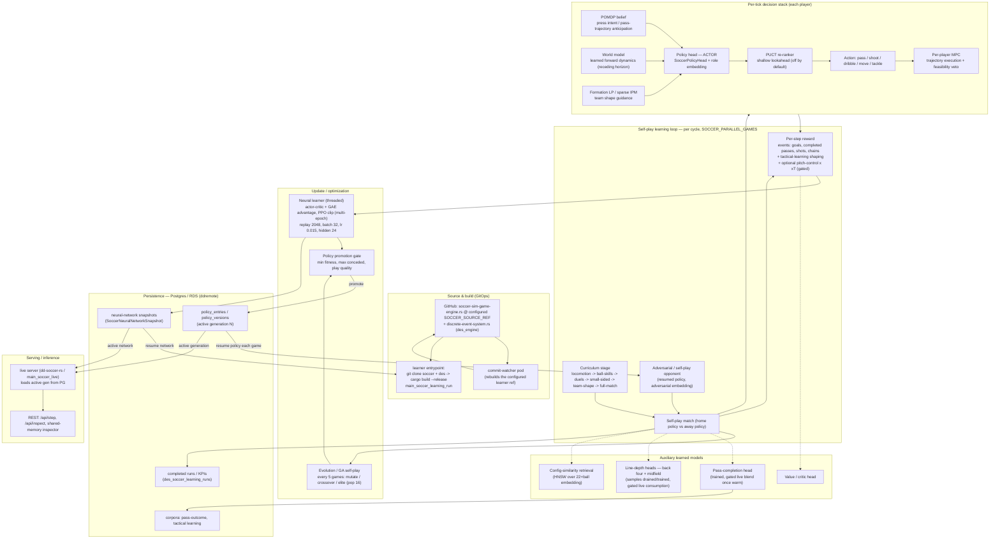
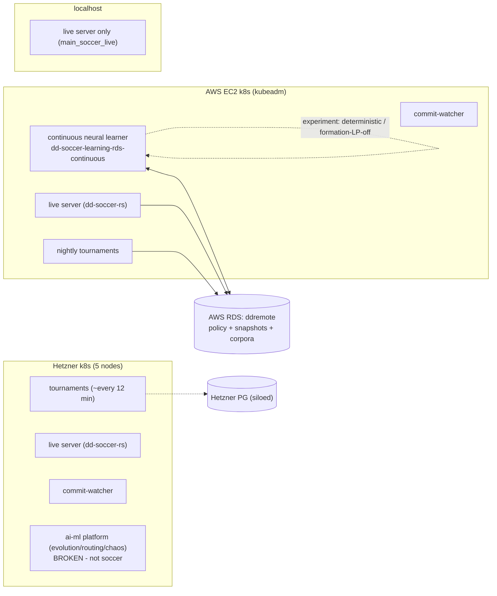

# Soccer self-play learning architecture

How the engine learns: from source build, through the self-play loop and the
per-tick decision stack, into the learners, the Postgres-backed policy store, and
finally the live inference server. Grounded in the running continuous learner
(`main_soccer_learning_run`) and its live config. Generation numbers drift quickly;
query Postgres or `/soccer/inspect` for the current active/candidate generation.

## End-to-end flow

## Deployment topology

## How a generation advances (the loop in words)

1. **Build** — the learner pod clones the configured `SOCCER_SOURCE_REF`
   (soccer + des), `cargo build`s `main_soccer_learning_run`, and resumes the
   latest policy + neural network from Postgres.
2. **Curriculum** — each cycle picks a stage (locomotion → … → full-match) that
   reshapes the drill (players-per-team, duration, pitch).
3. **Self-play** — `SOCCER_PARALLEL_GAMES` matches of the current policy vs an
   adversarial/resumed opponent. The deployed continuous learner is commonly kept
   at `1` for deterministic progress, while queue/worker topology is separate.
   Each tick, every player runs the decision stack: POMDP belief + world model +
   formation LP feed the **policy head (actor)**; the chosen action is executed
   through **per-player MPC**.
4. **Reward** — event rewards (goals, passes, shots, chains) + tactical-learning
   shaping, with an **optional** dense pitch-control × xT territorial term.
5. **Update** — the **neural learner** does actor-critic + GAE with PPO-clipped
   multi-epoch updates over a replay buffer; **GA evolution** (every 5 games)
   mutates/crosses/selects the population.
6. **Promotion gate** — a candidate policy is promoted to a new **generation**
   only if it clears fitness / goals-conceded / play-quality thresholds.
7. **Persist** — promoted policy versions, neural-network snapshots, and corpora
   are written to Postgres (RDS `ddremote`).
8. **Serve** — the live server loads the active generation from Postgres and
   answers `/api/step` for the game/UI. The next learner cycle resumes from the
   same store, closing the loop.

## Status legend

- **Live & advancing:** policy head (actor-critic + GAE + PPO-clip), GA evolution,
  curriculum, promotion gate, Postgres policy store, live serving — all running on
  AWS when the continuous learner deployment is scaled and healthy. Use the DB,
  logs, or inspect endpoint for the exact generation.
- **Dashed = dormant / gated (capacity built, not yet learning):**
  - **Pass-completion head** — trained on the corpus and blended live only when
    `learned_pass_completion_enabled()` is on and the head has enough training
    steps; otherwise the analytic estimate remains the fallback.
  - **Line-depth heads** (back four + midfield) — the learner drains samples,
    reward-weights them, trains a carried head, and the runtime consumes it only
    once the gate/head warm-up checks pass. The back-four vector is the full
    169-feature 22-player+ball field-motion view; the head is currently carried
    in memory across games, with cross-restart Postgres durability still the
    remaining hardening step.
  - **Pitch-control × xT reward** — implemented, **gated off** by default.
  - **PUCT re-ranker** — present, off by default.
- **Not learning:** Hetzner runs tournaments + serving but **no neural learner**;
  localhost serves only. The AWS continuous learner is usually deployed with
  `SOCCER_PARALLEL_GAMES=1`.

See [back-four-line-model.md](back-four-line-model.md) and
[learnability-conversion-roadmap.md](learnability-conversion-roadmap.md) for the
models being wired into this loop next.
