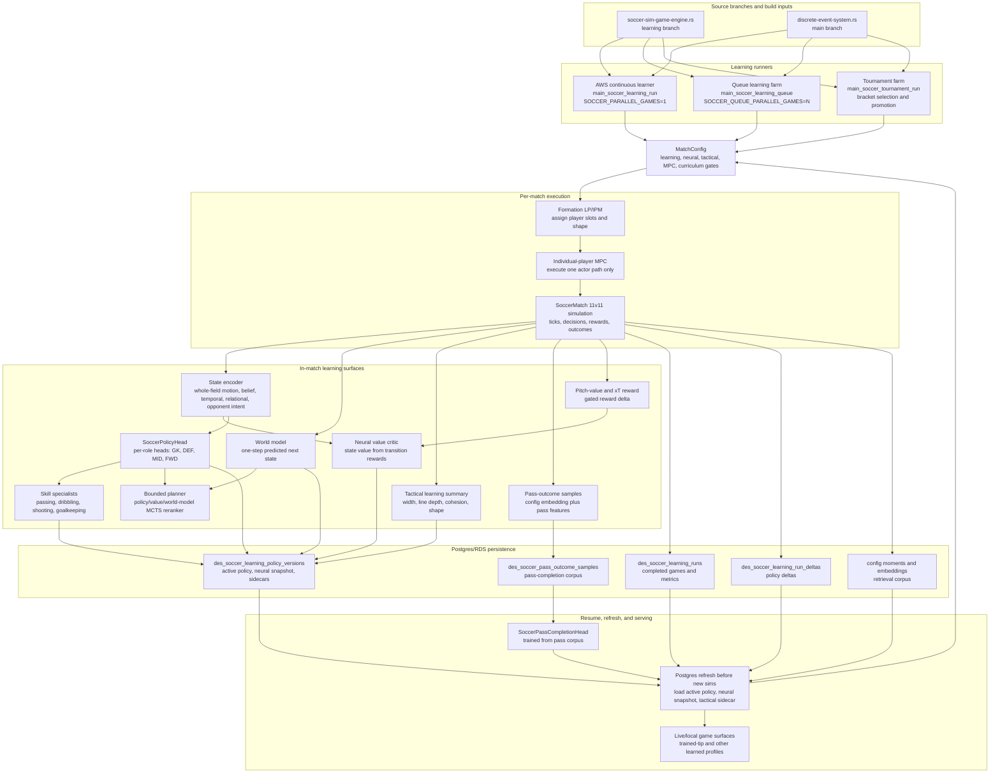

# Soccer learning architecture

This is the current end-to-end learning shape for the soccer engine: how self-play
is launched, what gets trained inside a match, what is persisted, and how the next
run resumes from the learned state.



## Operating contracts

- `main_soccer_learning_run` is the stable continuous lane. It is intentionally
  kept at `SOCCER_PARALLEL_GAMES=1` so its cycle is deterministic and easy to
  reason about.
- Extra throughput comes from `main_soccer_learning_queue` and tournament farms,
  not by increasing continuous `SOCCER_PARALLEL_GAMES`.
- The canonical AWS continuous learner pulls `soccer-sim-game-engine.rs` from the
  `learning` branch and `discrete-event-system.rs` from `main`.
- Formation shape is LP/IPM. MPC is only an individual-player execution tool:
  other players and the ball are obstacles/context, never co-optimized team state.
- The actor is not a single undifferentiated model anymore. `SoccerPolicyHead`
  has per-role heads for goalkeeper, defender, midfielder, and forward, and those
  role heads carry independent passing, dribbling, shooting, and goalkeeping
  specialist heads.
- The current neural stack is still an MLP family over engineered features, not
  a graph-attention or recurrent model. It is acceptable as the stable baseline
  because the inputs now include whole-field player motion, short-horizon
  history, perception confidence, opponent-press belief, relational pressure
  summaries, and opponent-intent channels.
- POMDP behavior must remain explicit: decisions carry a belief summary, learned
  samples preserve `behavior_policy_probability` for PPO/MAPPO ratios, and MPC
  is an executor/reconciler rather than the tactical solver.
- MAPPO-style team learning should keep decentralized actors at runtime while
  using centralized team reward and advantage shaping during training. Do not
  regress to 11 unrelated policies with no shared credit signal.
- Pass completion is a separate learned head. Matches capture
  `SoccerPassOutcomeSample` rows at pass launch/resolution, bulk persistence writes
  them to `des_soccer_pass_outcome_samples`, and the learner trains
  `SoccerPassCompletionHead` from that pooled corpus.
- Back-four line depth, midfield line depth, and pitch-value/xT are gated learning
  surfaces. Production learning enables:
  - `DD_SOCCER_ENABLE_BACK_FOUR_LINE_MODEL=true`
  - `DD_SOCCER_ENABLE_MIDFIELD_LINE_MODEL=true`
  - `DD_SOCCER_ENABLE_PITCH_VALUE_REWARD=true`

## What to watch in logs

- `source_commit_actual=...` should match the intended `learning` commit.
- `parallel_games=1` should remain true for the continuous learner.
- `soccer_learning_signal_capture ... pass_outcome_samples=...` shows whether
  completed games are producing pass-head data.
- `defender_line_depth_rows=...` and `midfield_line_depth_rows=...` show whether
  the line-depth gates are producing usable training rows.
- `postgres_pass_completion_training ... loaded=... trained_steps=...` confirms
  the separate passing head has a useful persisted corpus.
- Queue farm logs should show `SOCCER_QUEUE_PARALLEL_GAMES`, not continuous
  `SOCCER_PARALLEL_GAMES`, as the scale-out control.

## Neural-net audit verdict

The design target is not "replace MDP/POMDP with a bigger feedforward network."
The solver is the full chain:

```text
observation history + player/ball graph
  -> belief/state encoder
  -> policy, value, and optional world-model heads
  -> bounded search or rollout planner
  -> per-player MPC execution
```

The current engine already covers much of the audit:

- Spatial context is not just raw ego coordinates: the feature vector carries the
  22-player whole-field motion block plus relational pressure/support summaries.
- POMDP state is not stateless-only: player decisions carry belief summaries,
  perception confidence, opponent-press belief, pass-trajectory/intended-target
  belief, and short-horizon temporal channels.
- Multi-agent credit is not purely independent: MAPPO-style centralized team
  reward and advantage shaping train decentralized role/specialist actors.
- Planning is not a full match clone: the bounded neural-guided MCTS path reranks
  already-legal action candidates and may use the learned feature-space world
  model for shallow lookahead.
- MPC remains the movement layer: it makes the chosen intent physically
  executable and may veto/reconcile impossible actions, but it does not own
  tactical choice.

The important remaining upgrade is the representation layer. The present model is
still a feedforward stack over hand-built whole-field and belief features. A
stronger version should replace or precede that feature MLP with a graph-temporal
encoder: players and the ball as nodes, pass/mark/pressure/teammate edges,
attention or message passing for spatial relations, and recurrent or transformer
memory for opponent intent, fatigue, runs, and partially observed events. That
encoder should feed the same policy/value/world-model heads first, preserving the
existing `behavior_policy_probability`, MAPPO, bounded-planner, and MPC contracts.

Upgrade order:

1. Keep the current MLP path as the compatibility baseline and append-only
   migration target.
2. Add training/serving telemetry that shows whether temporal, relational,
   opponent-belief, and whole-field blocks are actually influencing value/policy.
3. Introduce a graph-temporal encoder behind the existing snapshot and feature
   contracts, then distill or A/B it against the MLP baseline.
4. Only after the encoder is stable, deepen offline search/imitation learning and
   target-level planning. Live play should stay budget-capped and MPC-bounded.
