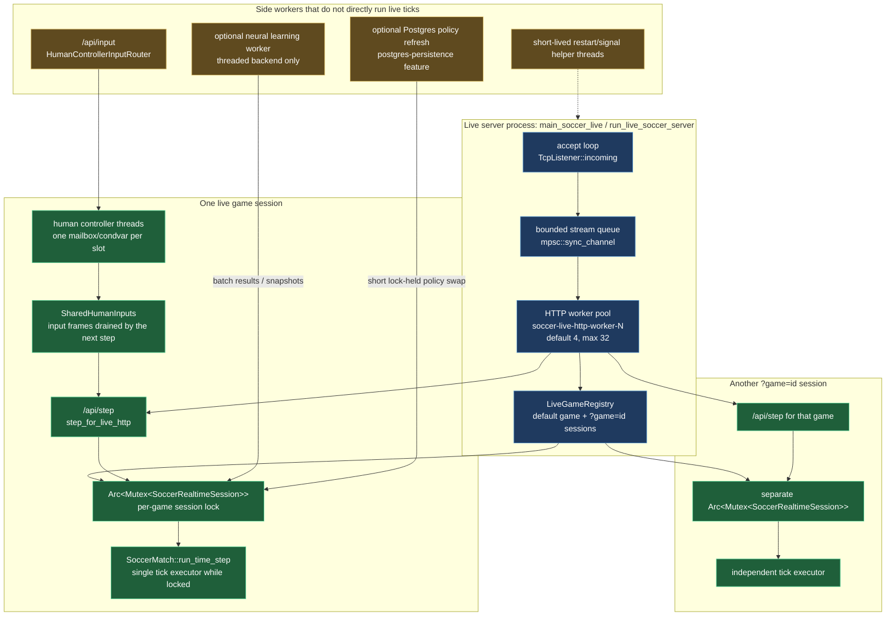
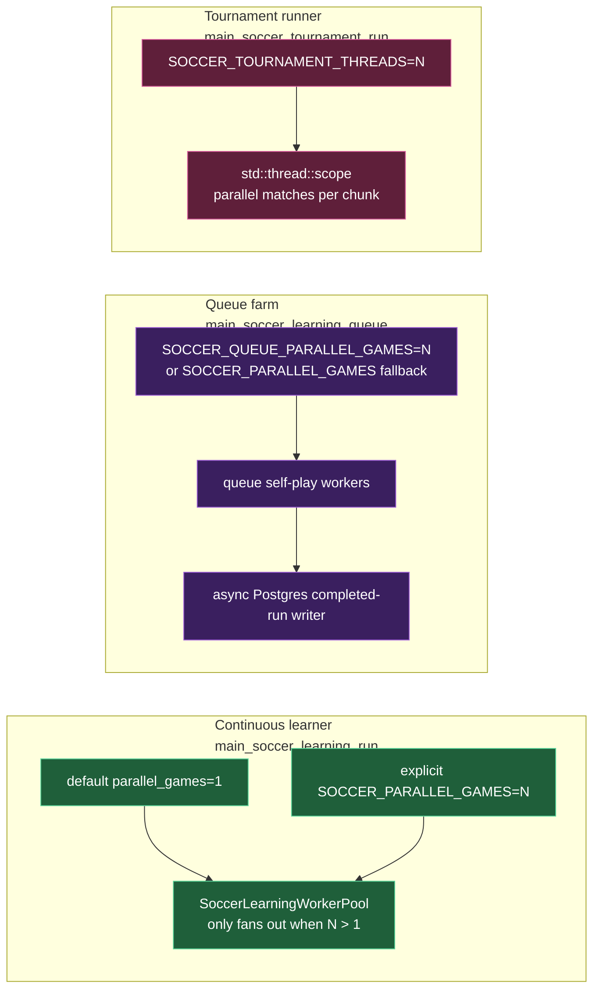

# Soccer thread model

The live server has worker threads, but a single live match does not have two
tick loops running at once. The game state for each live match is behind one
`Arc<Mutex<SoccerRealtimeSession>>`; whichever HTTP worker handles `/api/step`
must hold that session lock while it advances ticks.

## Live-game contract

- There are multiple live-server threads: the accept loop, HTTP workers, human
  controller threads, and optional side workers.
- A single game session advances ticks under one session mutex. Concurrent
  `/api/step` requests for that same game serialize on that lock.
- Named `?game=id` sessions are independent. Two different game ids may advance
  in parallel, because they have different session mutexes.
- `/api/input` can enqueue controller frames without stepping the match. Those
  inputs are consumed by the next locked tick batch.
- The runtime exposes this in `liveHttp`: `simulationStepModel` is
  `per-game-session-mutex`, with `gameTicksSingleThreadedPerSession=true` and
  `concurrentStepRequestsSerialized=true`.

## Learning and tournament workers

## Runner contract

- `main_soccer_learning_run` is the deterministic continuous lane. Its default is
  one game; extra parallelism must be explicit.
- Scale-out belongs in `main_soccer_learning_queue` and tournament runs, where
  parallel workers are the point of the runner.
- Tournament parallelism is scoped and deterministic in result ordering: matches
  may run concurrently, then outcomes are collected into the original order.
